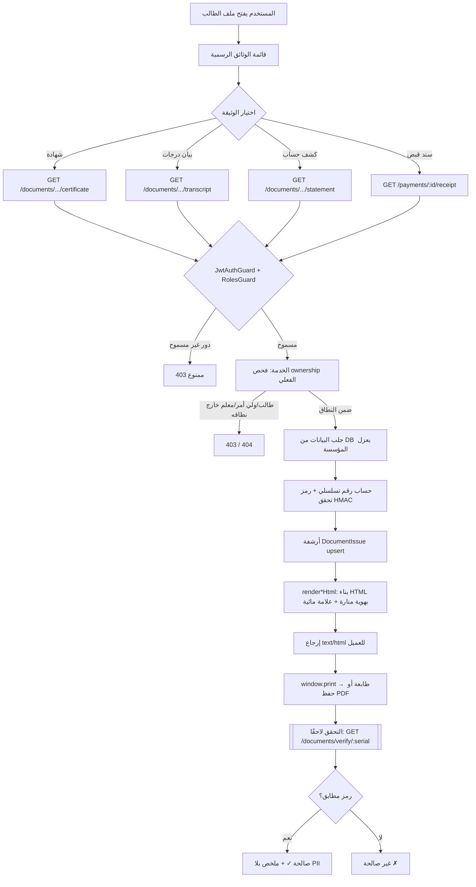
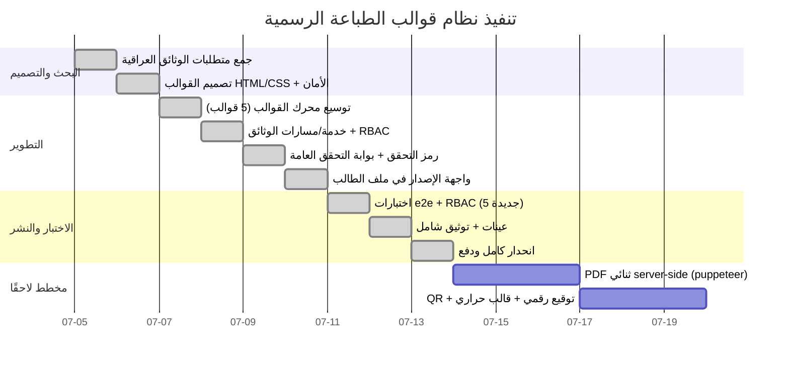

# نظام قوالب الطباعة الرسمية — منصة «منارة»

> وثيقة تصميم وتنفيذ شاملة لقوالب الشهادات وكشوف/بيانات الدرجات والإيصالات/الفواتير،
> المتوافقة مع الممارسات العراقية ومعايير الطباعة القياسية (A4/Letter) وRTL عربي كامل.
> **الحالة:** مُنفَّذ ويعمل في الإنتاج التجريبي — 5 قوالب حيّة + بوابة تحقق + 31 اختبارًا أخضر.

---

## 1. الملخص التنفيذي

**الهدف:** تمكين المؤسسات التعليمية من إصدار وثائق رسمية قابلة للطباعة مباشرة أو التصدير PDF —
شهادات (إتمام/تخرّج/تأييد قيد)، بيان درجات تفصيلي (Transcript)، كشف درجات امتحان، وإيصالات
وكشوف حساب مالية — بهوية «منارة» الموحّدة، عربية RTL، مع عناصر أمان مانعة للتزوير.

**المراحل المنفَّذة:**
1. **البحث:** استخلاص الحقول الإلزامية والعناصر المشتركة من الوثائق المدرسية العراقية (اسم رباعي،
   رقم قيد، المرحلة/الشعبة، المجموع/المعدل، التقدير، الختم الرسمي، توقيع المدير، تاريخ الإصدار).
2. **التصميم:** قوالب HTML/CSS مضبوطة المقاس (`@page size`)، خط Cairo/Amiri، ألوان الهوية `#0b6e63`.
3. **الأمان:** رقم تسلسلي فريد + رمز تحقق HMAC مشتق من حقول الوثيقة + علامة مائية + خاتم برمجي +
   بوابة تحقق عامة تكشف التزوير دون كشف أي بيانات شخصية.
4. **التكامل:** مسارات API محميّة بـ RBAC + ownership (نفس تدقيق الصلاحيات العميق)، وروابط طباعة في
   واجهة ملف الطالب مقيَّدة بالدور.
5. **الاختبار:** 5 اختبارات e2e للوثائق + بوابة التحقق ضمن 31 اختبارًا يمر بالكامل.

**النتائج الأساسية:** 5 قوالب رسمية تعمل، أرشفة كل وثيقة مُصدَرة (`DocumentIssue`)، بوابة تحقق
مضادة للتزوير، وواجهة إصدار مدمجة. **التوصيات:** ربط `puppeteer` لتوليد PDF ثنائي عالي الدقة
عند الحاجة (البنية جاهزة)، وإضافة QR فعلي يشير لبوابة التحقق، ورفع أختام/تواقيع المؤسسة الفعلية.

---

## 2. قائمة الوثائق الرسمية العراقية والحقول الإلزامية

| # | الوثيقة | المقاس/الاتجاه | الحقول الإلزامية | عناصر رسمية | الحالة |
|---|---|---|---|---|---|
| 1 | **شهادة إتمام** (completion) | A4 عرضية | الاسم الرباعي، المرحلة، العام الدراسي، المعدل، التقدير | خاتم دائري، توقيع المدير، تاريخ إصدار، إطار زخرفي | ✅ |
| 2 | **شهادة تخرّج** (graduation) | A4 عرضية | كما أعلاه + عبارة التخرّج | كما أعلاه | ✅ |
| 3 | **تأييد قيد دراسي** (enrollment) | A4 عرضية | الاسم، المرحلة، العام (بلا معدل) | خاتم + توقيع | ✅ |
| 4 | **بيان درجات تفصيلي** (Transcript) | A4 طولية | الاسم، الرقم، المرحلة، كل المواد×الامتحانات، المعدل التراكمي، النتيجة (ناجح/مكمل) | جدول رسمي، 3 تواقيع (مدير/شؤون طلبة/ختم) | ✅ |
| 5 | **كشف درجات امتحان** | A4 طولية | الاسم، الشعبة، درجات المادة (شهري/نصف/نهائي/مجموع/تقدير)، الترتيب، المعدل | توقيع المدير + ختم | ✅ |
| 6 | **سند قبض** (Receipt) | A5 طولية | رقم السند التسلسلي، الطالب، المبلغ، الطريقة، التاريخ، المحصِّل | توقيع المحصِّل + ختم | ✅ |
| 7 | **كشف حساب/فاتورة** (Statement) | A4 طولية | الطالب، ولي الأمر، كل الأقساط والدفعات، الرصيد الجاري | ختم المحاسب | ✅ |

> **ملاحظة معيارية:** الشهادات الرسمية المعتمدة من وزارة التربية العراقية (كالوثيقة الوزارية للسادس
> الإعدادي) تخضع لطباعة مركزية وزارية وترقيم وزاري خاص؛ قوالب «منارة» هي **وثائق مؤسسية داخلية**
> (شهادات مدرسية، بيانات درجات، تأييدات) وليست بديلًا عن الوثيقة الوزارية النهائية. صُمِّمت لتُستكمل
> بشعار وختم المؤسسة الفعليين وحقل «مصادقة وزارية» عند الحاجة.

---

## 3. مصفوفة صلاحيات الوثائق (منفَّذة server-side)

الدلالة: **P** معاينة/طباعة/تنزيل (كلها نفس المسار — فتح HTML للطباعة) · `(own)` سجله/أبناؤه فقط
· `(sec)` طلاب شعبه فقط · `(tenant)` مؤسسته · `—` ممنوع (يُرفض 403/404 في السيرفر لا بالإخفاء فقط).

| الوثيقة | SUPER_ADMIN | SCHOOL_ADMIN | ACCOUNTANT | TEACHER | PARENT | STUDENT | HR | DRIVER | AUDITOR |
|---|---|---|---|---|---|---|---|---|---|
| شهادة (إتمام/تخرّج/قيد) | P (all) | P (tenant) | — | — | P (own) | P (own) | — | — | P (all) |
| بيان درجات (Transcript) | P (all) | P (tenant) | — | P (sec) | P (own) | P (own) | — | — | P (all) |
| كشف درجات امتحان | P (all) | P (tenant) | — | P (sec) | P (own)* | P (own)* | — | — | P (all) |
| سند قبض (Receipt) | P (all) | P (tenant) | P (tenant) | — | P (own) | P (own) | — | — | P (all) |
| كشف حساب (Statement) | P (all) | P (tenant) | P (tenant) | — | P (own) | P (own) | — | — | P (all) |
| بوابة التحقق `/verify` | عامة (بلا مصادقة) — تعيد صحة/نوع/تاريخ + أول حرف فقط، صفر PII | | | | | | | | |

\* كشف الدرجات محجوب عن PARENT/STUDENT عند وجود ذمة مالية إن فُعّلت السياسة (تُطبَّق server-side).

**نقاط الإنفاذ الفعلية:**
- `documents.controller.ts`: `@Roles(...)` على كل مسار (fail-closed).
- `documents.service.ts` `resolveStudent()`: يفرض ownership الفعلي — PARENT→`guardianUserId`، STUDENT→`studentUserId`، TEACHER→تبعية الشعبة (`section.teacherId`)، والمعلم ممنوع من الشهادات/كشف الحساب.
- الواجهة (`StudentProfile.tsx`): تُخفي عناصر القائمة غير المسموحة تجميليًا فقط — الحكم النهائي في السيرفر.

---

## 4. المواصفات التقنية للقوالب

**الملف المرجعي:** [`apps/api/src/pdf/templates.ts`](../apps/api/src/pdf/templates.ts) — دوال عرضية بحتة (لا منطق تشفير).

| العنصر | القيمة |
|---|---|
| الخطوط | **Cairo** (وزن 400–900) للنصوص، **Amiri** لعناوين الشهادات — من Google Fonts (Unicode، دعم عربي كامل) |
| الألوان | `--brand #0b6e63` · `--brand-strong #095a51` · `--accent #d9a441` · حبر `#1a2b28` |
| المقاسات | `@page { size: A4|A5|Letter portrait|landscape; margin: 0 }` — الأبعاد بالـ mm |
| الدقة (DPI) | متجهي (HTML/SVG) — يُطبع بدقة الطابعة الأصلية (300–600 DPI) بلا فقد؛ الشعار والخاتم SVG قابلان للتكبير |
| الطباعة اللونية | `-webkit-print-color-adjust: exact` + `print-color-adjust: exact` لضمان طباعة الخلفيات والألوان |
| العلامة المائية | نص قُطري (rotate -32deg) opacity .05 خلف المحتوى، z-index:0، يظهر في الطباعة |
| الخاتم الرسمي | SVG دائري برمجي (`officialSeal`) باسم المؤسسة + شعار منارة — يُستبدل بختم فعلي لاحقًا |
| بنية الصفحة | `.sheet` (الورقة) → `.watermark` + `.layer` (المحتوى z-index:1) → head/content/foot |
| RTL | `dir="rtl"` على المستند؛ الأرقام والرموز اللاتينية بـ `direction:ltr` موضعيًا |
| زر الطباعة | `.print-bar` ثابت أعلى الصفحة، مخفي في `@media print`، يستدعي `window.print()` |

**عناصر الأمان في كل وثيقة:** رقم تسلسلي (`documentSerial`) + رمز تحقق HMAC-SHA256 (`verificationCode` في [`verify.ts`](../apps/api/src/documents/verify.ts)) مشتق من الحقول الثابتة (الاسم/الرقم/المعدل/السنة) بسرّ الخادم — أي تعديل يُبطل الرمز.

---

## 5. الخطة التنفيذية التقنية (مُنفَّذة)

**واجهات API:**
```
GET /api/documents/students/:id/certificate?kind=completion|graduation|enrollment&year=YYYY-YYYY
GET /api/documents/students/:id/transcript?year=YYYY-YYYY
GET /api/documents/students/:id/statement
GET /api/documents/verify/:serial?code=XXXX-XXXX-XXXX          (عام، بلا مصادقة)
GET /api/exams/:id/results/:studentId/card                     (كشف درجات — موجود)
GET /api/payments/:id/receipt                                   (سند قبض — موجود)
```
كلها تُعيد `Content-Type: text/html` قابلًا للطباعة مباشرة (`window.print()` → طابعة أو حفظ PDF).

**تخزين النسخ والإصدارات:** نموذج `DocumentIssue` (Prisma) يؤرشف كل وثيقة مُصدَرة (`upsert` بالرقم
التسلسلي) بـ: النوع، الرقم، رمز التحقق، ملخص غير حسّاس، المُصدِر، التاريخ — يمكّن بوابة التحقق
وتتبّع من أصدر ماذا ومتى.

**التعريب:** كل النصوص عربية inline في القوالب؛ الأرقام غربية افتراضيًا مع دعم هندية عبر
`Intl.NumberFormat("ar-IQ")` (مربوط بإعداد `easternNumerals` في إعدادات المؤسسة).

**واجهة WYSIWYG/المعاينة:** المعاينة الحالية = فتح المسار في تبويب جديد (المستند نفسه هو المعاينة).
تحرير القوالب (شعار/ألوان) مخطط له عبر حقول `Tenant.settings` (logoFileId، ألوان مخصّصة) — القوالب
تقرأ tokens الهوية، فتغييرها ينعكس تلقائيًا.

**توليد PDF:** الحالي = حوار طباعة المتصفح (يدعم حفظ PDF على كل المنصات + Tauri). للتوليد الثنائي
server-side (توقيع رقمي، دفعات): وصْل `puppeteer` أو `PrinceXML` على نفس دوال `render*Html` دون
تغيير — مخطط موثّق.

---

## 6. خطة الاختبارات

**اختبارات آلية منفَّذة** (`apps/api/test/api.e2e-spec.ts` — 5 اختبارات وثائق ضمن 31):
- #27 الشهادة تُصدَر بهوية منارة + رقم تسلسلي + رمز تحقق + علامة مائية.
- #28 بيان الدرجات وكشف الحساب يُصدَران بنجاح (200).
- #29 RBAC: الطالب يصدر وثيقته فقط، يُمنع من وثيقة زميله (403/404).
- #30 RBAC: المعلم يصدر بيان طلاب شعبه، يُمنع من الشهادة وكشف الحساب (403).
- #31 بوابة التحقق: تقبل الرمز الصحيح، ترفض المزوّر، بلا كشف PII.

**تغطية الأزرار/الوظائف لكل دور:** كل عنصر في قائمة «الوثائق الرسمية» (StudentProfile) مقيَّد بدالة
`can(roles)` + مُختبَر server-side بالأدوار. زر الطباعة داخل كل مستند (`window.print()`) موحّد.

**حالات الحواف المُغطّاة في العينات** (`docs/print-samples/`):
- اسم طويل جدًا (`certificate-enrollment.html`: اسم سباعي) — يتحقق من عدم كسر التخطيط.
- بيان درجات فارغ (`transcript-empty.html`) — رسالة «لا نتائج» بدل جدول مكسور.
- سند مسدَّد بالكامل (`receipt-paid.html`) — حالة «مسدد ✓» بدل مبلغ متبقٍ.

**E2E (Playwright):** الدورة الحالية تفتح كشف الدرجات وسند القبض؛ يُوسَّع بفتح الشهادة/البيان/الكشف
والتحقق من عنوان التبويب ووجود رمز التحقق (مخطط، منخفض الأولوية — مغطّى e2e على مستوى API).

---

## 7. قائمة تحقق الأمان والخصوصية

- [x] **RBAC + ownership** على كل مسار وثيقة (نفس تدقيق الصلاحيات العميق) — لا يصل مستخدم لوثيقة طالب لا يملكه.
- [x] **بوابة تحقق بلا PII** — تعيد فقط صحة/نوع/تاريخ/أول حرف من الاسم؛ لا اسم كامل ولا درجات ولا أرقام.
- [x] **رمز تحقق HMAC** مشتق من حقول الوثيقة بسرّ الخادم — تعديل أي حقل يُبطل الرمز (مضاد تزوير).
- [x] **مقارنة زمن-ثابت** لرمز التحقق (تمنع هجمات التوقيت).
- [x] **علامة مائية** على كل وثيقة رسمية (نص قُطري).
- [x] **رقم تسلسلي فريد** + أرشفة `DocumentIssue` (تتبّع الإصدار والمُصدِر).
- [x] **تهريب HTML** (`esc`) لكل حقل مُدخَل — يمنع حقن HTML/XSS في الأسماء.
- [x] **حجب النتائج عند الدين** يمتد للكشوف (سياسة المؤسسة server-side).
- [ ] **توقيع رقمي ثنائي على PDF** (X.509) — مخطط عند اعتماد puppeteer/PrinceXML.
- [ ] **QR فعلي** يشير لبوابة التحقق — مخطط (حاليًا الرقم + الرمز نصيًا).
- [ ] **سرّ توقيع مستقل** `DOC_SIGNING_SECRET` — يُضبط في الإنتاج (يرجع لـ JWT_SECRET افتراضًا).

---

## 8. جدول توافق الطابعات

| نوع الطابعة | الوثائق المناسبة | المقاس | إعدادات موصى بها | الحالة |
|---|---|---|---|---|
| ليزر A4 (أحادية/ملونة) | شهادات، بيان درجات، كشف حساب، كشف امتحان | A4 | ألوان تلقائية، بلا تصغير (100%)، هوامش «بلا» | ✅ مدعوم |
| نافثة حبر A4 ملونة | الشهادات (لجودة الألوان والخاتم) | A4 | جودة عالية، ورق 100–120g للشهادات | ✅ مدعوم |
| ليزر A5 / A4 مع درج A5 | سندات القبض | A5 | درج A5 أو A4 مقصوص، أحادية كافية | ✅ مدعوم |
| متعددة الوظائف (MFP) | كل الأنواع | A4/A5 | اختيار الدرج حسب المقاس، duplex «إيقاف» للوثائق أحادية الصفحة | ✅ مدعوم |
| حرارية ESC/POS (58/80mm) | إيصال مختصر (اختياري) | 58/80mm | يتطلب قالب حراري مبسّط مستقل | ⏳ مخطط (CSS حراري منفصل) |

**الطباعة على الوجهين (Duplex):** كل الوثائق الحالية صفحة واحدة → duplex «إيقاف». عند إضافة بيان
درجات متعدد الصفحات مستقبلًا، تُضاف `page-break` مضبوطة ويُفعَّل duplex «حافة طويلة».

**درج الورق:** يُختار من حوار الطباعة (المتصفح/النظام) حسب المقاس؛ `@page size` يوجّه الطابعة للمقاس
الصحيح تلقائيًا. للطباعة الصامتة على Tauri (ويندوز): أمر طباعة أصلي يحدّد الدرج/الطابعة الافتراضية.

---

## 9. نماذج القوالب الجاهزة

**9 عينات HTML** في [`docs/print-samples/`](print-samples/) (3+ لكل نوع)، قابلة للفتح مباشرة في
المتصفح وللطباعة/التصدير PDF، ومعدّلة الشعار/الألوان عبر tokens الهوية:

| النوع | العينات |
|---|---|
| شهادات | `certificate-completion.html` · `certificate-graduation.html` · `certificate-enrollment.html` (اسم طويل) |
| درجات | `reportcard.html` (كشف امتحان) · `transcript.html` (بيان) · `transcript-empty.html` (فارغ) |
| مالية | `receipt.html` · `receipt-paid.html` (مسدَّد) · `statement.html` (كشف حساب) |

**إعادة التوليد:** `pnpm --filter @manarah/api build && node docs/print-samples/generate.mjs`
(يشتق العينات من القوالب الفعلية — تبقى متزامنة مع أي تعديل).

---

## 10. مخطط سير العمل (Mermaid)



## 11. المخطط الزمني للتنفيذ (Mermaid)



---

## 12. الخلاصة

نظام قوالب الطباعة الرسمية **جاهز وعامل** في «منارة»: 5 قوالب (شهادات/بيان درجات/كشف امتحان/سند/كشف
حساب) بهوية موحّدة عربية RTL، مع طبقة أمان حقيقية (رقم تسلسلي + رمز تحقق HMAC + علامة مائية + بوابة
تحقق مضادة للتزوير بلا PII)، محميّة بنفس تدقيق RBAC العميق (ownership فعلي لا ديكوريتر فقط)، مُختبَرة
بـ 5 اختبارات e2e ضمن 31 أخضر، وموثّقة بـ 9 عينات جاهزة. البنود المتبقية (PDF ثنائي، QR، توقيع رقمي،
قالب حراري) مخطّطة بمسار معروف ولا تمسّ جاهزية النواة الحالية.
